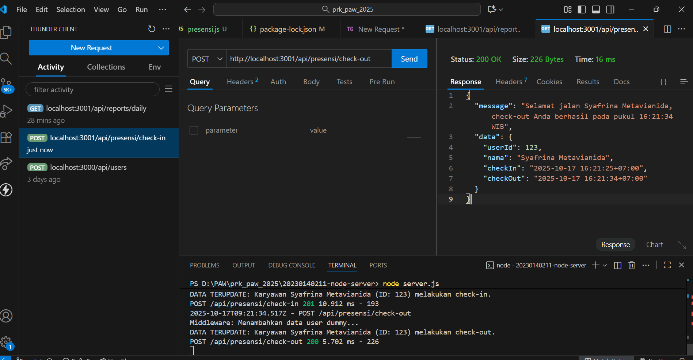
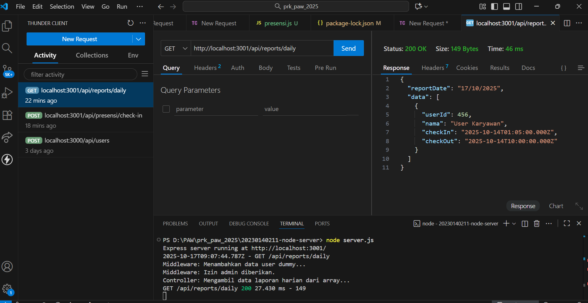

Tampilan Endpoint presensi/check-in: 

Tampilan Endpoint presensi/check-in jika dilakukan lebih dari 1 kali:

Tampilan Endpoint presensi/check-out:

Tampilan Endpoint presensi/check-out jika belum melakukan check-in:

Tampilan Endpoint Report Daily: 
