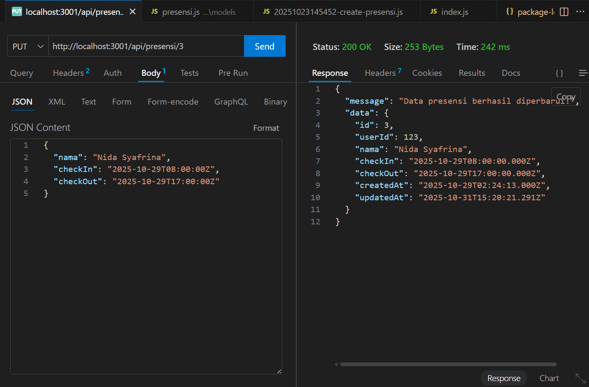
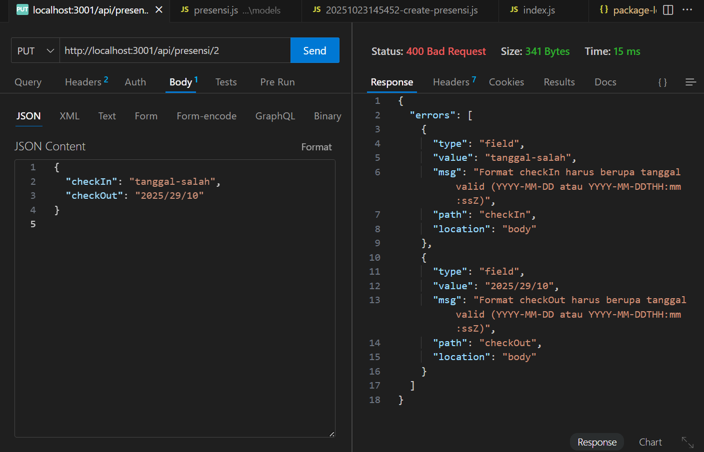
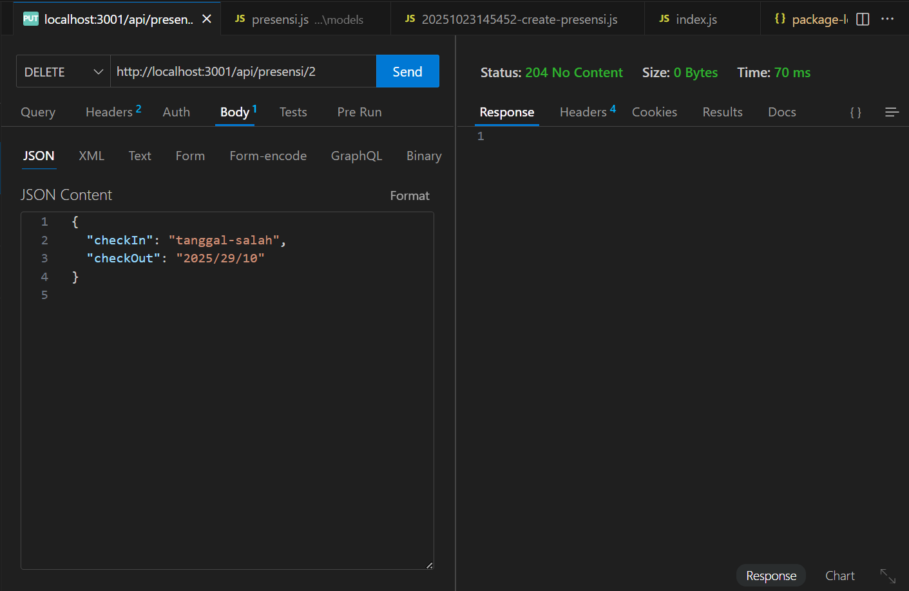
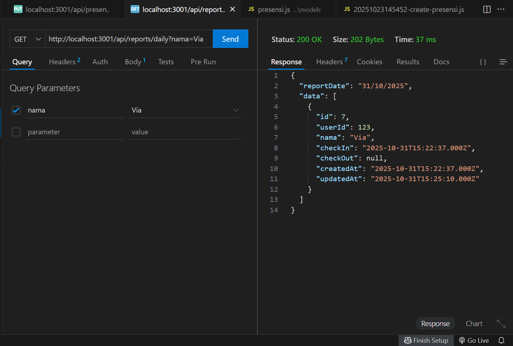
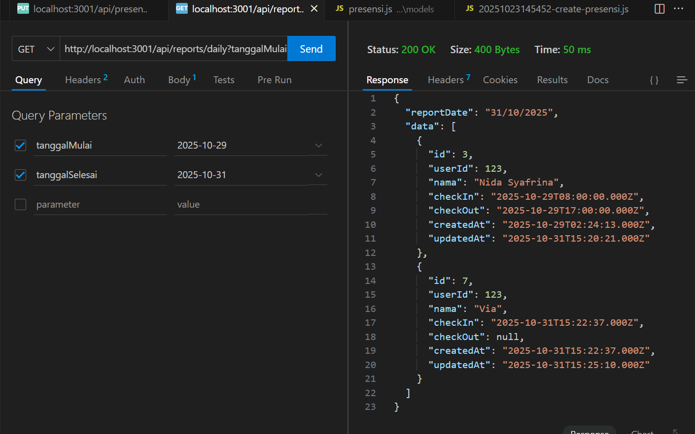

 Tampilan Endpoint update data presensi:

Tampilan Endpoint update jika format tanggal yang diisi tidak valid :

Tampilan  Endpoint delete data :

Tampilan search berdasarkan Nama :

Tampilan search berdasarkan tanggal :

