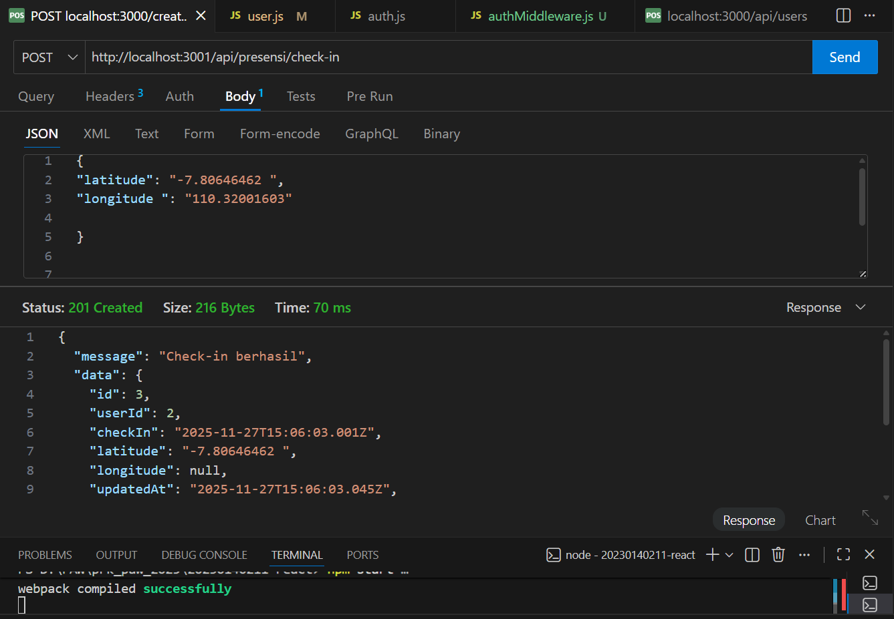
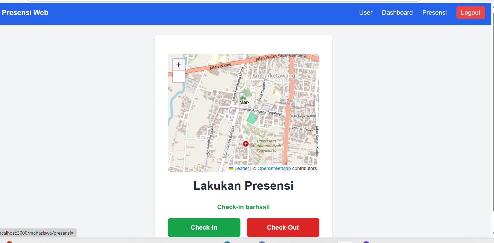
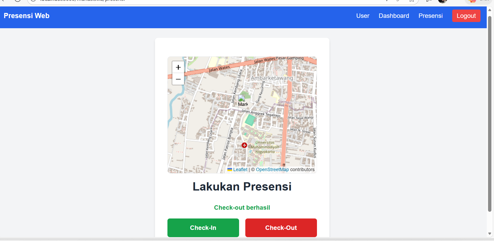
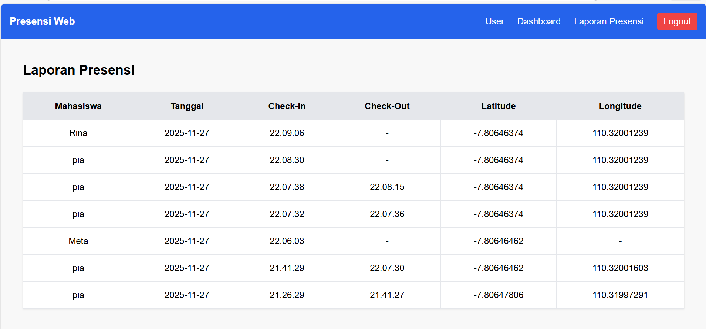
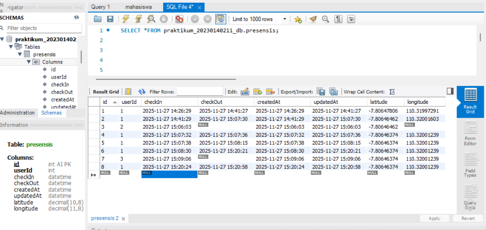

Endpoint presensi/check-in dengan menggunakan bearer token dan body latitude, longitude:

Check-in berhasil :

Check-out berhasil :

Tampilan halaman report yg berisi data presensi dari semua user :

tabel presensi database :
